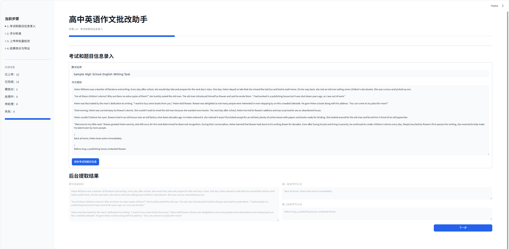
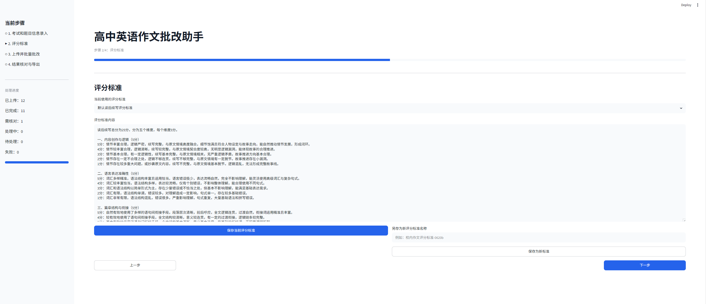
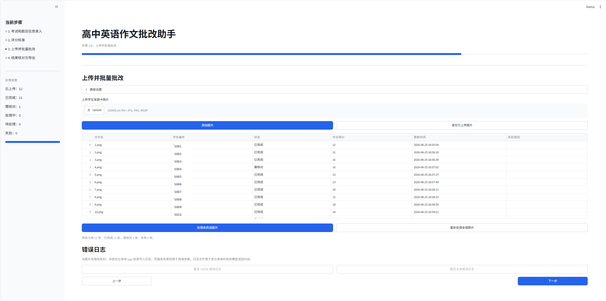
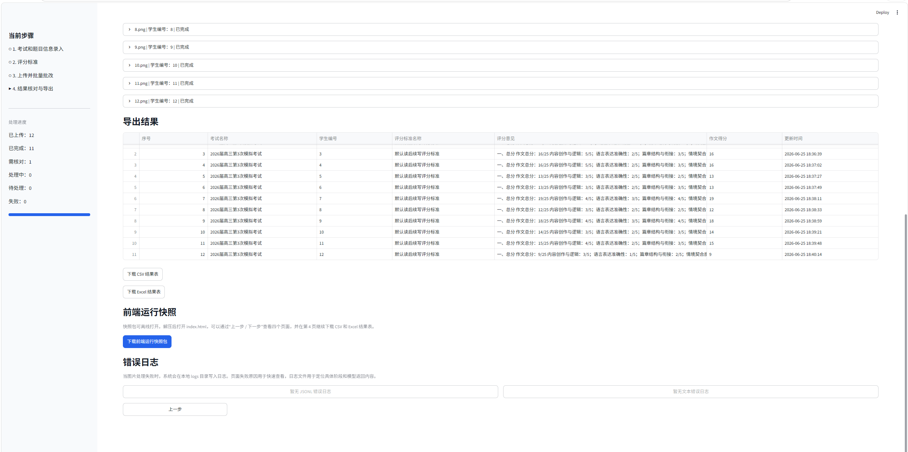
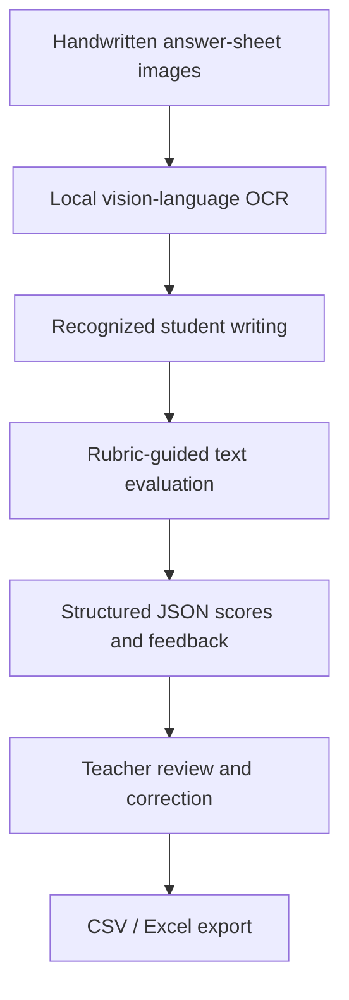

# High School English Writing Grading Assistant（高中英语作文批改助手）

A local teacher-assistive educational NLP prototype for high school English writing assessment.

This project was developed from a real teaching need: high school English writing assessment is time-consuming, partly subjective, and requires timely feedback for students. The current demonstration focuses on Chinese Gaokao continuation writing because it is a common and practical task in senior high school English teaching. The workflow, however, is designed as a general teacher-assistive writing-assessment framework and can be adapted to other prompt-based writing tasks with appropriate rubrics and prompts.

The prototype supports a four-step workflow in which teachers enter the writing prompt and rubric, upload handwritten answer-sheet images, run local OCR and rubric-based feedback generation through Ollama, review the model outputs, and export structured results.

The project is intended as an applied educational NLP prototype. It explores OCR-based text recognition, rubric-guided feedback generation, structured JSON parsing, score validation, and human-in-the-loop review. It is not a production grading system, does not train a custom scoring model, and does not replace teacher judgment.

## Demo Screenshots

The screenshots below show the actual Streamlit front-end. The static demo snapshot included in this repository is intended for offline viewing, but it is not a pixel-perfect copy of the live Streamlit interface.

### 1. Exam and prompt input



### 2. Rubric configuration



### 3. Batch upload and processing



### 4. Review, export, and snapshot generation



## Main Features

- Four-step Streamlit workflow:
  1. exam and prompt input;
  2. scoring rubric configuration;
  3. batch upload and processing;
  4. result review, export, and static snapshot generation.
- Batch upload of handwritten answer-sheet images.
- Two-stage local model workflow:
  - OCR stage: image to recognized writing;
  - scoring stage: recognized text to rubric-based feedback and scores.
- Rubric-based scoring across five dimensions:
  - content creation and logic;
  - language accuracy;
  - coherence and cohesion;
  - contextual fit;
  - writing conventions.
- Human-in-the-loop review: teachers can inspect OCR outputs, review model-generated scores and feedback, and manually revise final scores and feedback before export.
- Score validation: the total score is normalized as the sum of the five sub-scores.
- CSV and Excel export.
- Error logging for model and parsing failures.
- Static front-end snapshot export for offline demonstration.

## Project Scope

This project focuses on building an end-to-end prototype workflow rather than training a new NLP model. The main contribution is the integration of OCR-based handwritten text recognition, rubric-guided feedback generation, structured output parsing, score validation, and teacher review in an educational writing-assessment scenario.

The prototype is designed to support teachers in reviewing English writing tasks more efficiently. It does not make final grading decisions automatically, and all OCR outputs, scores, and feedback should be checked by a teacher.

Although the current demo uses a continuation-writing task, the core workflow is not limited to this task type. Other prompt-based writing tasks would require redesigned prompts, rubrics, and validation procedures.

## NLP / Computational Linguistics Relevance

This project demonstrates a practical language-processing pipeline in an educational assessment context:



Relevant components include OCR-based text recognition, rubric-guided feedback generation, structured JSON output parsing, score validation, error handling, and human-in-the-loop review.

## Tech Stack

- Python
- Streamlit
- Ollama local API
- Local vision-language model, default: `qwen3-vl:4b`
- pandas and openpyxl for CSV / Excel export
- Pillow for image handling
- JSON-based model output parsing and validation

## Repository Structure

```text
gaokao-continuation-writing-assistant/
├── app.py
├── grader_module.py
├── requirements.txt
├── README.md
├── LICENSE
├── .gitignore
├── .streamlit/
│   └── config.toml
├── docs/
│   ├── technical_design.md
│   ├── privacy_note.md
│   ├── limitations.md
│   └── archive/
│       └── review_design_zh.md
├── samples/
│   ├── answer_sheets/
│   ├── sample_prompt.txt
│   ├── scoring_rubric.txt
│   ├── sample_output.csv
│   └── sample_output.xlsx
├── screenshots/
│   ├── page1_exam_input.png
│   ├── page2_scoring_rubric.png
│   ├── page3_batch_processing.png
│   └── page4_review_export.png
└── demo_snapshot/
    ├── index.html
    ├── data.json
    ├── README_snapshot.txt
    ├── assets/
    ├── export/
    └── logs/
```

## Requirements

- Python 3.10+
- Ollama running locally
- A local vision-language model available through Ollama, such as `qwen3-vl:4b`

The model files are not included in this repository.

## Installation

```bash
git clone https://github.com/<your-username>/gaokao-continuation-writing-assistant.git
cd gaokao-continuation-writing-assistant
python -m venv .venv
```

Activate the virtual environment.

Windows:

```bash
.venv\Scripts\activate
```

macOS / Linux:

```bash
source .venv/bin/activate
```

Install dependencies:

```bash
pip install -r requirements.txt
```

## Ollama Setup

Install and start Ollama, then pull the local model used by the prototype:

```bash
ollama pull qwen3-vl:4b
```

The application calls the local Ollama API at:

```text
http://localhost:11434/api/generate
```

## Run the Application

```bash
streamlit run app.py
```

Then open:

```text
http://localhost:8501
```

## Demo Data

The repository includes 12 anonymized sample answer-sheet images under:

```text
samples/answer_sheets/
```

The sample answer sheets included in this repository are anonymized or self-created demonstration samples. They do not contain student names, school names, class information, contact details, examination IDs, or other personally identifiable information. They are provided only to demonstrate the application workflow.

The sample rubric and feedback are written in Chinese because the intended users of the prototype are Chinese senior high school English teachers. The application logic, however, is documented in English in this README for international review.

The demo output files are available under:

```text
samples/sample_output.csv
samples/sample_output.xlsx
```

## Static Demo Snapshot

A static front-end snapshot is included under:

```text
demo_snapshot/index.html
```

Open `demo_snapshot/index.html` in a browser to view a pre-generated demonstration. The snapshot supports page switching and includes downloadable CSV / Excel result files on the final page. It is meant for quick visual inspection and GitHub demonstration; the live Streamlit interface remains the source of truth for the actual user experience.

## Privacy

This project is designed as a local prototype. The model is called through a local Ollama service, and the application does not intentionally upload writing content or answer-sheet images to a cloud API.

The sample answer sheets included in this repository are anonymized or self-created demonstration samples. They do not contain student names, school names, class information, contact details, examination IDs, or other personally identifiable information. They are provided only to demonstrate the application workflow.

See [`docs/privacy_note.md`](docs/privacy_note.md) for details.

## Limitations

- The system is a teacher-assistive prototype, not a production automatic grading system.
- Model-generated OCR and scoring outputs may contain errors.
- Scores and feedback require teacher review.
- The project does not train a custom scoring model.
- No formal evaluation dataset, accuracy benchmark, inter-rater reliability study, or classroom deployment study is included.

See [`docs/limitations.md`](docs/limitations.md) for more details.

## License

This project is released under the MIT License. See [`LICENSE`](LICENSE).
