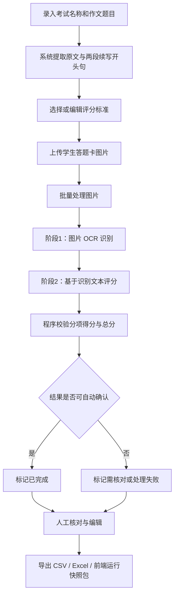
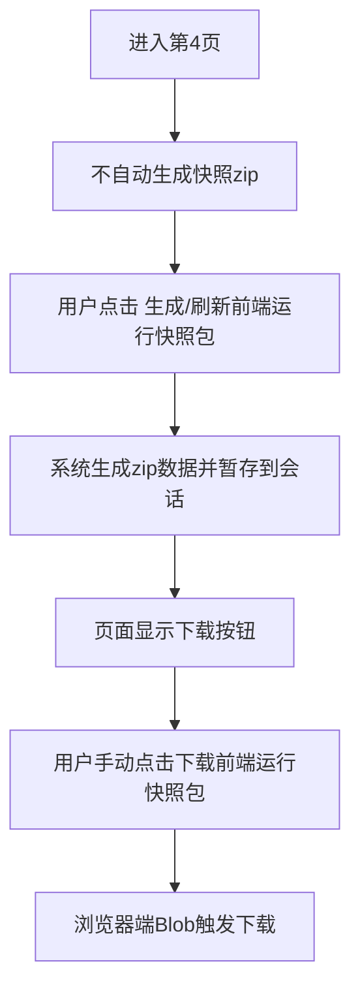
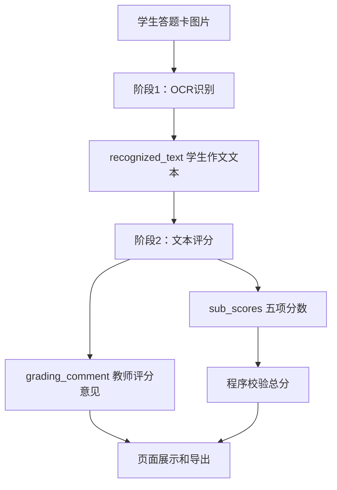

# 高中英语作文批改助手 0625b_fixed 功能评审设计文档

> 本文档用于业务需求方进行功能评审，判断当前版本是否符合预期。本文档不是 GitHub 对外 README，不以宣传展示为目的，而是说明当前版本的业务流程、功能边界、页面设计、模型处理逻辑、结果校验与待确认事项。

---

## 1. 文档信息

| 项目 | 内容 |
|---|---|
| 应用名称 | 高中英语作文批改助手 |
| 评审版本 | 0625b_fixed |
| 应用形态 | 本地 Streamlit Web 应用 |
| 核心模型 | 本地 Ollama 模型，默认 `qwen3-vl:4b` |
| 主要使用对象 | 高中英语教师、教研人员、批改辅助人员 |
| 主要业务场景 | 批量上传高考英语读后续写答题卡图片，自动识别作文文本、生成评分意见、导出批改结果 |
| 数据存储方式 | 当前运行会话内存为主；错误日志写入本地 `logs/` 目录；结果可导出 CSV / Excel / 前端运行快照包 |

---

## 2. 版本定位

0625b_fixed 是在 0625a_fixed 基础上的功能增强与问题修复版本。当前版本的定位是：

1. 支持完整的四步式作文批改流程；
2. 支持本地视觉模型完成作文图片识别；
3. 支持本地模型根据读后续写评分要求生成分项得分和教师评分意见；
4. 支持人工核对、结果修正和导出；
5. 支持生成可离线打开的前端运行快照包，用于向他人展示一次完整运行结果；
6. 修复进入第 4 页时 IDM 等下载管理器可能自动抓取快照 zip 的问题。

当前版本更接近“可评审、可试用、可演示”的本地工具版本，但仍不是带数据库、用户权限、长期任务队列的正式生产系统。

---

## 3. 总体业务流程

应用一共 4 个页面，用户通过页面底部的“上一步 / 下一步”完成流程切换。


整体处理过程如下：



---

## 4. 页面设计说明

### 4.1 页面 1：考试和题目信息录入

#### 业务目标

让教师录入本次批改任务的考试名称和完整作文题目信息。作文题目中包含：

- 原文阅读材料；
- 第一段续写开头句；
- 第二段续写开头句。

#### 当前设计

页面字段如下：

| 字段 | 说明 |
|---|---|
| 考试名称 | 用于导出结果中的“考试名称”字段 |
| 作文题目 | 粘贴完整读后续写题目内容 |

系统会在后台从“作文题目”中自动提取：

| 提取内容 | 用途 |
|---|---|
| 原文阅读材料 | 用于判断续写是否承接原文情节、人物性格和主题 |
| 第一段续写开头句 | 用于判断第一段续写是否自然承接 |
| 第二段续写开头句 | 用于判断第二段续写是否自然承接 |

#### 开头句定位规则

建议在两段续写开头句前使用 `/` 标识，例如：

```text
原文阅读材料……

/ 第一段续写开头句……
/ 第二段续写开头句……
```

系统会根据该标识尝试自动拆分原文和两段续写开头句。如果提取失败或不完整，页面会给出提示，用户可以调整作文题目格式。

#### 评审关注点

| 评审项 | 是否需要确认 |
|---|---|
| 是否接受“作文题目”合并录入，而不再拆成三个输入框 | 是 |
| `/` 作为开头句定位符是否符合日常录入习惯 | 是 |
| 后台提取结果展示是否足够清楚 | 是 |

---

### 4.2 页面 2：评分标准

#### 业务目标

允许教师使用默认读后续写评分标准，也可以编辑并保存自定义评分标准。

#### 当前设计

| 功能 | 说明 |
|---|---|
| 当前使用的评分标准 | 下拉选择当前评分标准 |
| 评分标准内容 | 文本框展示并允许编辑 |
| 保存当前评分标准 | 覆盖当前标准内容 |
| 保存为新标准 | 输入新名称后另存为新的评分标准 |

#### 默认评分方向

当前默认评分围绕五个维度，每个维度 5 分，总分 25 分：

| 维度 | 满分 |
|---|---:|
| 内容创作与逻辑 | 5 |
| 语言表达准确性 | 5 |
| 篇章结构与衔接 | 5 |
| 情境契合度 | 5 |
| 写作规范性 | 5 |
| 合计 | 25 |

#### 评审关注点

| 评审项 | 是否需要确认 |
|---|---|
| 五个维度是否符合业务方期望 | 是 |
| 每项 5 分、总分 25 分是否固定 | 是 |
| 自定义标准是否需要持久化到本地文件或数据库 | 待确认 |

当前版本中，自定义评分标准主要保存在本次 Streamlit 会话中。如果刷新或重新启动应用，可能需要重新录入。

---

### 4.3 页面 3：上传并批量批改

#### 业务目标

批量上传学生答题卡图片，并自动完成识别和评分。

#### 当前设计

页面包含：

| 功能 | 说明 |
|---|---|
| 高级设置 | 可配置 Ollama 模型名称和上下文长度 `num_ctx` |
| 上传学生答题卡图片 | 支持 JPG、PNG、WEBP，多文件上传 |
| 添加图片 | 将上传文件加入当前批改列表 |
| 清空已上传图片 | 清除当前会话中的图片列表和处理结果 |
| 状态表 | 展示文件名、学生编号、状态、作文得分、更新时间、失败原因 |
| 处理未完成图片 | 只处理未完成或失败的图片 |
| 重新处理全部图片 | 对全部图片重新识别和评分 |
| 错误日志下载 | 下载 JSONL 和文本格式错误日志 |

#### 学生编号规则

当前版本根据文件名自动推断学生编号：

| 文件名示例 | 学生编号 |
|---|---|
| `1.png` | `1` |
| `003.jpg` | `003` |
| `studentA.png` | `studentA` |

#### 批处理状态

| 状态 | 含义 |
|---|---|
| 待处理 | 图片已加入列表，但尚未处理 |
| 排队中 | 批处理任务已开始，等待轮到该图片 |
| 处理中 | 当前图片正在 OCR 或评分 |
| 已完成 | 已成功识别、评分，并且结果可自动确认 |
| 需核对 | 系统得到了部分结果，但存在需要人工确认的问题 |
| 处理失败 | OCR、评分、模型服务或解析过程中出现不可自动处理的错误 |

#### 当前状态判断规则

系统会尽量把可自动处理的问题归为“已完成”，减少不必要的人工核对。

| 情况 | 页面状态 |
|---|---|
| 五项分数完整，评分意见完整，总分可计算 | 已完成 |
| 模型返回总分与五项合计不一致，但系统已按五项合计自动修正 | 已完成 |
| 五个分项得分未完整输出 | 需核对 |
| 分项得分超出 0-5 范围 | 需核对或处理失败 |
| 总分超出 0-25 范围且无法修正 | 需核对或处理失败 |
| 缺少教师评分意见 | 需核对或处理失败 |
| 模型明确标记 `review_required=true` | 需核对 |
| Ollama 连接失败、HTTP 错误、超时、资源不足 | 处理失败 |

#### 评审关注点

| 评审项 | 是否需要确认 |
|---|---|
| 状态表字段是否足够教师快速判断处理情况 | 是 |
| “总分与五项合计不一致但已自动修正”是否应继续显示为已完成 | 已按当前需求实现 |
| 是否需要支持手动录入学生姓名或班级 | 待确认 |
| 是否需要支持并发处理 | 待确认。当前为串行处理，便于稳定调用本地模型 |

---

### 4.4 页面 4：结果核对与导出

#### 业务目标

让教师查看批改结果、逐个核对、手动编辑评分意见或得分，并导出结果。

#### 当前设计

页面包含：

| 模块 | 说明 |
|---|---|
| 状态表 | 展示所有学生图片处理状态和分数 |
| 逐个核对 | 每个学生一个折叠卡片，可查看识别文本、评分意见、原始输出和元数据 |
| 编辑评分意见 | 教师可修改模型生成的评分意见 |
| 编辑作文得分 | 教师可修改作文得分 |
| 从评分意见重新提取得分 | 从已编辑的评分意见中重新解析总分 |
| 保存评分意见和得分 | 保存当前人工修改结果 |
| 导出结果 | 导出 CSV 和 Excel |
| 前端运行快照 | 手动生成并下载静态快照包 |
| 错误日志 | 下载本地错误日志 |

#### 导出字段

CSV 和 Excel 结果表包含以下字段：

| 字段 | 说明 |
|---|---|
| 序号 | 从 1 开始的结果序号 |
| 考试名称 | 第 1 页录入的考试名称 |
| 学生编号 | 根据文件名自动推断或会话中保存的编号 |
| 评分标准名称 | 当前使用的评分标准名称 |
| 评分意见 | 教师评分意见，可能由模型生成，也可能由人工编辑 |
| 作文得分 | 最终保存的作文总分 |
| 更新时间 | 当前结果最后更新时间 |

#### 前端运行快照包

0625b_fixed 新增前端运行快照包功能。第 4 页提供：

1. 生成 / 刷新前端运行快照包；
2. 下载前端运行快照包。

快照包是 zip 文件，解压后打开 `index.html` 即可离线查看一次完整运行结果。

快照包结构：

```text
frontend_snapshot_0625b_fixed.zip
├─ index.html
├─ data.json
├─ README_snapshot.txt
├─ assets/
│  └─ images/
│     └─ 学生答题卡图片
├─ export/
│  ├─ 高中英语作文批改结果_0625b_fixed.csv
│  └─ 高中英语作文批改结果_0625b_fixed.xlsx
└─ logs/
   ├─ processing_errors.jsonl
   └─ processing_errors.log
```

快照页面支持：

| 功能 | 是否支持 |
|---|---:|
| 离线打开 `index.html` | 支持 |
| “上一步 / 下一步”切换四个页面 | 支持 |
| 查看考试信息 | 支持 |
| 查看评分标准 | 支持 |
| 查看上传图片和处理状态 | 支持 |
| 查看 OCR 文本和评分意见 | 支持 |
| 查看模型原始输出和元数据 | 支持 |
| 第 4 页下载 CSV 结果表 | 支持 |
| 第 4 页下载 Excel 结果表 | 支持，前提是生成快照时 Excel 可用 |

#### 关于快照页面效果的说明

当前快照页面用于“离线查看运行结果”和“提供 GitHub 展示素材”，不是 Streamlit 前端的 1:1 复刻。特别是第 3 页，静态快照与真实前端页面在布局、交互细节和视觉效果上存在差距。后续如果撰写 GitHub README 或业务展示材料，应以真实前端运行效果为准，快照只作为结果数据和流程补充。

#### IDM 自动下载修复

0625b 曾出现进入第 4 页后 IDM 自动弹出下载快照 zip 的情况。0625b_fixed 已调整为：



修复点：

| 修改前 | 修改后 |
|---|---|
| 第 4 页渲染时即注册 Streamlit zip 下载资源 | 第 4 页不自动注册 zip 下载资源 |
| IDM 可能扫描下载端点并自动抓取 | 必须用户先生成，再手动点击下载 |
| 使用 Streamlit 原生下载按钮暴露 zip endpoint | 使用浏览器端 Blob 下载方式 |

---

## 5. 模型处理设计

### 5.1 两阶段处理

当前版本不再让模型一次性完成“图片识别 + 评分”。系统采用两阶段处理：



### 5.2 阶段 1：OCR 识别

输入：

- 学生答题卡图片；
- OCR 专用提示词。

输出：

```json
{
  "recognized_text": "学生作文识别文本",
  "recognition_note": "识别备注"
}
```

处理要求：

| 要求 | 说明 |
|---|---|
| 只识别作文正文 | 不要求模型评分 |
| 不对作文进行润色 | 尽量保留学生原始表达 |
| 不确定内容可标注 | 可在文本中使用 `[?]` 或在备注中说明 |
| 若无法识别正文 | 标记为 OCR 失败 |

### 5.3 阶段 2：文本评分

输入：

- 原文阅读材料；
- 两段续写开头句；
- 评分标准；
- OCR 识别出的学生作文文本；
- 识别备注。

模型输出要求：

```json
{
  "sub_scores": {
    "内容创作与逻辑": {
      "basis": "该维度具体评分依据",
      "score": 0-5
    },
    "语言表达准确性": {
      "basis": "该维度具体评分依据",
      "score": 0-5
    },
    "篇章结构与衔接": {
      "basis": "该维度具体评分依据",
      "score": 0-5
    },
    "情境契合度": {
      "basis": "该维度具体评分依据",
      "score": 0-5
    },
    "写作规范性": {
      "basis": "该维度具体评分依据",
      "score": 0-5
    }
  },
  "score": "五项合计",
  "score_text": "作文总分：__/25",
  "grading_comment": "教师评分意见",
  "review_required": false,
  "parse_note": "无"
}
```

### 5.4 模型调用稳定性策略

| 策略 | 说明 |
|---|---|
| `think=false` | 请求体顶层关闭 thinking |
| `/no_think` | 提示词中再次要求不输出思考过程 |
| JSON 模式 | 使用 `format=json` 提高结构化输出稳定性 |
| `response` / `thinking` 兜底 | 如果有效 JSON 出现在 `thinking` 字段，系统会兼容解析 |
| OCR 与评分拆分 | 降低单次模型调用任务复杂度 |
| 评分失败重试 | 遇到部分可重试错误时，使用更短 prompt 和更小上下文重试 |
| 模板照抄检测 | 如果模型疑似照抄旧评分模板，自动重新评分一次 |

---

## 6. 评分与总分校验规则

### 6.1 五项分数规则

| 规则 | 说明 |
|---|---|
| 分项范围 | 每项 0-5 分 |
| 分数步长 | 0.5 分 |
| 总分范围 | 0-25 分 |
| 总分计算 | 总分 = 五个分项得分之和 |
| 总分来源 | 以程序校验后的五项合计为准 |

### 6.2 总分修正规则

如果模型返回：

```text
score = 18
五项合计 = 17.5
```

系统会自动修正为：

```text
最终作文得分 = 17.5
```

并在解析提示中记录：

```text
模型返回总分与五项合计不一致，已按五项合计修正。
```

该情况在前端显示为“已完成”，不再显示“需核对”。

### 6.3 需要人工核对的情况

以下情况仍需要人工核对：

| 情况 | 原因 |
|---|---|
| 五个分项未完整输出 | 无法可靠计算总分 |
| 分项得分超出 0-5 范围 | 分数异常 |
| 总分超出 0-25 且无法修正 | 分数异常 |
| 缺少教师评分意见 | 导出结果不完整 |
| OCR 识别文本明显异常 | 可能影响评分准确性 |
| 模型明确标记需要人工核对 | 模型自判不确定 |

---

## 7. 数据结构与结果字段

### 7.1 会话内核心数据

当前系统主要使用 Streamlit `session_state` 保存运行时数据。

| 数据项 | 内容 |
|---|---|
| `exam` | 考试名称、作文题目、原文、两段续写开头句 |
| `rubrics` | 评分标准集合 |
| `selected_rubric_name` | 当前选中的评分标准名称 |
| `answers` | 所有学生图片及其处理结果 |
| `model_name` | 当前 Ollama 模型名称 |
| `num_ctx` | 当前模型上下文长度 |
| `snapshot_zip_data` | 已生成的前端快照包数据 |

### 7.2 单个学生结果字段

| 字段 | 说明 |
|---|---|
| 文件名 | 上传图片文件名 |
| 学生编号 | 根据文件名推断 |
| 图片数据 | 原始图片二进制内容 |
| 状态 | 待处理、处理中、已完成、需核对、处理失败等 |
| OCR 识别文本 | 模型识别出的作文正文 |
| 识别备注 | OCR 阶段备注 |
| 教师评分意见 | 模型生成或教师编辑后的评分意见 |
| 作文得分 | 最终总分 |
| 分项得分 | 五个维度分数，用于校验总分 |
| 解析提示 | 系统对模型输出的修正或提示 |
| 原始输出 | OCR 阶段和评分阶段的模型原始输出 |
| Ollama 元数据 | 调用阶段、token、输出字段来源、重试信息等 |
| 失败原因 | 处理失败时展示的简明原因 |
| 更新时间 | 当前结果最后更新时间 |

### 7.3 导出结果字段

最终 CSV / Excel 只导出业务方要求的核心字段：

```text
序号、考试名称、学生编号、评分标准名称、评分意见、作文得分、更新时间
```

当前版本未将五个分项得分拆成独立导出列。如果业务方希望后续进行数据统计，可以在下一版增加：

```text
内容创作与逻辑、语言表达准确性、篇章结构与衔接、情境契合度、写作规范性
```

---

## 8. 错误日志设计

### 8.1 日志文件

当图片处理失败时，系统会写入本地日志：

```text
logs/processing_errors.jsonl
logs/processing_errors.log
```

| 文件 | 用途 |
|---|---|
| `processing_errors.jsonl` | 结构化日志，便于后续程序分析 |
| `processing_errors.log` | 文本日志，便于人工快速查看 |

### 8.2 日志记录内容

日志会尽量记录以下信息：

| 信息 | 说明 |
|---|---|
| 文件名 | 哪张图片失败 |
| 学生编号 | 对应学生 |
| 阶段 | OCR 请求、OCR 解析、评分请求、评分解析、应用层异常等 |
| 错误码 | 错误分类 |
| 错误信息 | 页面展示的简明失败原因 |
| 原始输出预览 | 模型原始返回内容摘要 |
| HTTP 信息 | 状态码、请求失败原因等 |
| Ollama 元数据 | `done_reason`、token 数、`used_output_field` 等 |
| 异常堆栈 | 程序异常时用于定位代码问题 |

### 8.3 常见错误处理

| 错误类型 | 页面表现 | 建议处理 |
|---|---|---|
| Ollama 未启动 | 处理失败 | 启动 Ollama 后重试 |
| HTTP 500 | 处理失败 | 重启 Ollama，降低 `num_ctx`，减少单批数量 |
| 资源不足 | 处理失败，可能暂停批处理 | 重启 Ollama 或降低上下文长度 |
| OCR 未识别正文 | 处理失败 | 检查图片清晰度和答题区域 |
| 评分缺少分项 | 需核对或失败 | 查看原始输出，必要时重新处理 |
| 模型输出总分与分项不一致 | 已完成 | 系统自动按五项合计修正 |

---

## 9. 非功能设计

### 9.1 本地运行与隐私

当前系统调用本地 Ollama 服务，默认地址：

```text
http://localhost:11434/api/generate
```

学生作文图片和批改结果默认不上传到外部云服务。这一设计更适合学校或教师本地试用。

### 9.2 性能与稳定性

当前版本采用串行批处理，即一张图片处理完成后再处理下一张图片。

| 设计 | 原因 |
|---|---|
| 串行处理 | 减少本地模型资源竞争，降低 Ollama 崩溃概率 |
| 两阶段处理 | 降低单次 prompt 复杂度 |
| 资源错误后暂停 | 避免 Ollama 已不可用时连续产生大量失败记录 |

### 9.3 当前边界

| 项目 | 当前状态 |
|---|---|
| 用户登录 / 权限 | 不支持 |
| 数据库持久化 | 不支持 |
| 多教师协作 | 不支持 |
| 云端批处理队列 | 不支持 |
| 自动保存历史批次 | 不支持 |
| 评分结果统计分析 | 暂未支持 |
| 五项分数独立导出 | 暂未支持 |

---

## 10. 评审验收清单

业务需求方可按以下清单评审当前版本。

### 10.1 流程验收

| 验收项 | 预期结果 | 是否通过 |
|---|---|---|
| 进入应用后显示“高中英语作文批改助手” | 页面标题正确 | 待评审 |
| 四个页面可通过“上一步 / 下一步”切换 | 流程清晰 | 待评审 |
| 左侧显示当前步骤和处理进度 | 能实时了解批改进展 | 待评审 |
| 第 1 页可保存考试和题目信息 | 可提取原文和两段开头句 | 待评审 |
| 第 2 页可编辑并保存评分标准 | 支持默认标准和自定义标准 | 待评审 |
| 第 3 页可批量上传图片 | 状态表显示上传结果 | 待评审 |
| 第 3 页可处理未完成图片 | 能逐张更新状态 | 待评审 |
| 第 4 页可查看并编辑结果 | 支持人工核对 | 待评审 |
| 第 4 页可导出 CSV / Excel | 文件字段符合要求 | 待评审 |
| 第 4 页可生成并下载快照包 | 不应进入页面自动触发下载 | 待评审 |

### 10.2 评分验收

| 验收项 | 预期结果 | 是否通过 |
|---|---|---|
| OCR 识别结果基本可读 | 识别文本能反映学生作文正文 | 待评审 |
| 评分意见能结合原文和开头句 | 不是普通作文泛评 | 待评审 |
| 五项分数有区分度 | 不应大面积输出同一组分数 | 待评审 |
| 总分等于五项合计 | 程序自动保证一致 | 待评审 |
| 语言错误较多的作文应扣语言分 | 分数符合教师直觉 | 待评审 |
| 情节偏离原文的作文应扣内容和情境分 | 分数符合读后续写要求 | 待评审 |
| 优秀作文与普通作文能拉开差距 | 分布合理 | 待评审 |

### 10.3 异常验收

| 验收项 | 预期结果 | 是否通过 |
|---|---|---|
| Ollama 未启动时 | 页面显示连接失败原因 | 待评审 |
| 图片不清晰时 | OCR 阶段给出失败或识别备注 | 待评审 |
| 模型输出总分与五项不一致时 | 自动按五项合计修正，显示已完成 | 待评审 |
| 分项缺失时 | 显示需核对或处理失败 | 待评审 |
| 处理失败时 | 可下载错误日志 | 待评审 |

---

## 11. 待业务方确认事项

| 编号 | 待确认问题 | 说明 |
|---|---|---|
| 1 | 是否固定总分 25 分 | 当前按五项各 5 分，总分 25 分设计 |
| 2 | 是否需要导出五个分项得分 | 当前导出只包含总分和评分意见 |
| 3 | 是否需要保存历史批次 | 当前刷新或重启后，运行数据不长期保存 |
| 4 | 是否需要手动录入学生姓名、班级 | 当前只根据文件名自动推断学生编号 |
| 5 | 是否接受 `/` 作为续写开头句定位符 | 当前推荐使用该标识提取两段开头句 |
| 6 | 是否需要自定义评分标准持久化 | 当前主要保存在会话中 |
| 7 | 是否需要批量统计分析 | 当前未提供平均分、分布图、分项统计 |
| 8 | 是否需要并发处理 | 当前串行处理更稳定，但速度较慢 |
| 9 | 快照页面是否仅作为离线查看结果，不要求与真实前端完全一致 | 当前快照不是 1:1 UI 复刻 |

---

## 12. 当前版本结论

0625b_fixed 已实现业务主流程：

```text
录入题目 → 设置评分标准 → 批量上传图片 → OCR识别 → 自动评分 → 人工核对 → 导出结果 → 生成离线快照
```

当前版本满足以下核心预期：

1. 能处理读后续写答题卡图片；
2. 能生成学生作文识别文本；
3. 能按五维度生成教师评分意见和作文总分；
4. 能强制保证作文总分等于五项得分之和；
5. 能区分已完成、需核对和处理失败；
6. 能导出 CSV 和 Excel；
7. 能生成静态前端运行快照包，并支持快照内下载 CSV / Excel；
8. 已修复进入第 4 页时下载管理器自动抓取快照 zip 的问题。

当前建议业务方重点评审：

- 评分结果是否符合高中英语读后续写教师的主观评分预期；
- 五个维度的设置是否准确；
- “需核对”的判定范围是否合适；
- 导出字段是否满足后续教务或教研使用；
- 是否需要增加历史批次保存、分项导出和统计分析。
