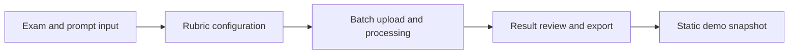

# Technical Design

## Project Name

**High School English Writing Grading Assistant（高中英语作文批改助手）**

## Purpose

This application is a local Streamlit prototype for teacher-assistive assessment of senior high school English continuation-writing tasks.

It is designed to help a teacher process handwritten answer-sheet images, obtain OCR text, generate rubric-based scoring feedback, review model outputs, and export structured results.

## Functional Workflow



## Four Pages

### Page 1: Exam and Prompt Input

The teacher enters the exam name and the full continuation-writing prompt. The system extracts:

- original reading passage;
- first paragraph starter;
- second paragraph starter.

### Page 2: Rubric Configuration

The application provides a default continuation-writing rubric and supports custom rubric editing.

### Page 3: Batch Upload and Processing

The teacher uploads answer-sheet images. The backend processes images serially while the front-end shows the batch status and progress.

Each image goes through two stages:

1. OCR stage: answer-sheet image to recognized student writing;
2. scoring stage: recognized writing to structured score and feedback.

### Page 4: Review, Export, and Snapshot

The teacher can review OCR output, scoring feedback, total score, and metadata. The application exports CSV / Excel results and can generate a static front-end snapshot package.

## Model Calling Strategy

The application calls a local Ollama service through HTTP. It uses a JSON-oriented prompt and parses structured model outputs.

Main safeguards:

- `think=false` is sent to reduce hidden reasoning output;
- if the model places valid JSON in the `thinking` field, the parser can use it as a fallback;
- OCR and scoring are separated into two stages to reduce prompt length;
- scoring outputs are validated and normalized;
- errors are logged for later diagnosis.

## Score Structure

The scoring stage expects five sub-scores:

| Dimension | Range |
|---|---:|
| Content creation and logic | 0–5 |
| Language accuracy | 0–5 |
| Coherence and cohesion | 0–5 |
| Contextual fit | 0–5 |
| Writing conventions | 0–5 |

The final score is normalized as:

```text
total score = sum of the five sub-scores
```

If the model's declared total score differs from the sub-score sum, the program uses the sub-score sum as the final score.

## Status Rules

| Status | Meaning |
|---|---|
| Pending | The image has not been processed. |
| Processing | The image is currently being processed. |
| Completed | OCR and scoring have completed successfully. |
| Review required | Key fields are missing, out of range, or explicitly marked for teacher review. |
| Failed | OCR/scoring failed due to model, connection, parsing, or image-reading errors. |

A mismatch between the model's total score and the sub-score sum is automatically corrected and does not by itself mark the result as review required.

## Export Fields

The exported CSV / Excel files include:

- sequence number;
- exam name;
- student identifier;
- scoring standard name;
- feedback;
- writing score;
- updated time.

## Snapshot Export

The static snapshot package includes a standalone HTML page, JSON data, answer-sheet images, and CSV / Excel export files. It is designed for offline demonstration and GitHub visual inspection, not as a replacement for the live Streamlit app.


## Public Demo Data

The sample answer sheets included in this repository are anonymized or self-created demonstration samples. They do not contain student names, school names, class information, contact details, examination IDs, or other personally identifiable information. They are provided only to demonstrate the application workflow.
